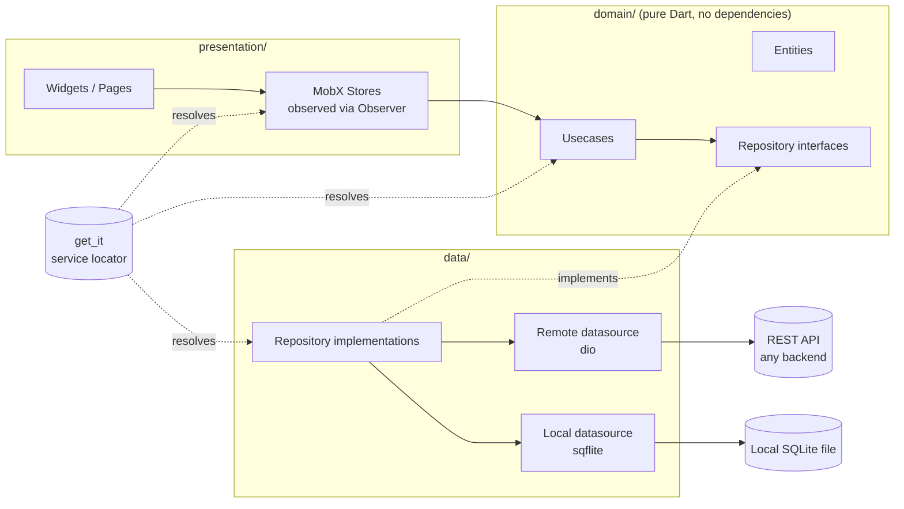
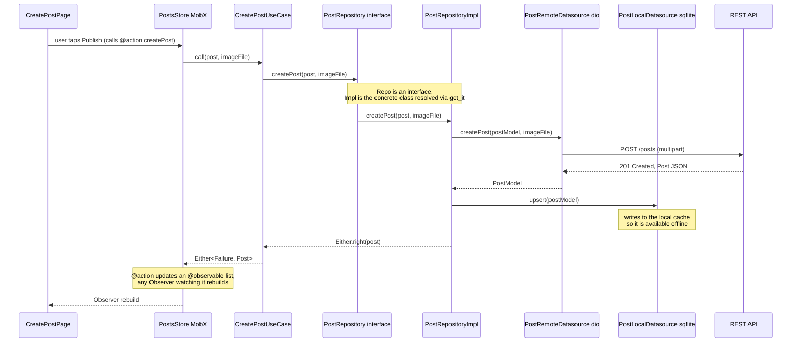

SocialFeed Tutorial (`socialfeed_app`)

A complete, hands-on walkthrough of building a well-architected Flutter mobile app with **Flutter 3.x** (Dart 3, null-safety), organized into Git branches that each cover a well-scoped concern, deliberately chosen so the tutorial also exercises a broad set of Flutter concepts along the way.

The app is **backend-agnostic**: it talks to a plain REST API over HTTP via `dio`. Any backend that implements the [API Contract](#api-contract) below works, whether it is written in Node/Express, NestJS, Spring Boot, Laravel, Django, or anything else. This tutorial does not ship a backend; it assumes one already exists or is built separately.

This document is the **complete specification** of the mobile client. It is meant to be followed step by step, branch by branch.

---

## Prerequisites

- Flutter 3.x SDK and Dart 3.x installed (`flutter --version` to check)
- Comfortable with core Dart syntax (classes, null-safety, `async`/`await`)
- Android Studio or Xcode set up for at least one target platform (emulator/simulator or a physical device)
- A backend implementing the [API Contract](#api-contract), reachable from the device/emulator running the app
- No prior experience with `dio`, MobX, or `sqflite` is required; each is introduced from scratch

---

## Table of Contents

- [Prerequisites](#prerequisites)
- [Tech Stack](#tech-stack)
- [Concept Map](#concept-map)
- [Non-Goals](#non-goals)
- [Domain Model](#domain-model)
- [API Contract](#api-contract)
- [Auth Model](#auth-model)
- [Architecture](#architecture)
- [Branching Strategy](#branching-strategy)
- [Project Structure](#project-structure)
- [Result and Failure Handling](#result-and-failure-handling)
- [Git Commit Convention](#git-commit-convention)
- [feature/core-architecture](#featurecore-architecture)
- [feature/design-system](#featuredesign-system)
- [feature/data-modeling](#featuredata-modeling)
- [feature/offline-and-sync](#featureoffline-and-sync)
- [feature/auth](#featureauth)
- [feature/users](#featureusers)
- [feature/posts](#featureposts)
- [feature/comments](#featurecomments)
- [feature/likes](#featurelikes)
- [feature/quality-and-release](#featurequality-and-release)
- [feature/integrations (bonus)](#featureintegrations-bonus)
- [Order of Work](#order-of-work)
- [Code Conventions](#code-conventions)
- [Concepts Covered](#concepts-covered)
- [Troubleshooting](#troubleshooting)
- [Contributing](#contributing)
- [License](#license)
- [How to Follow This Tutorial](#how-to-follow-this-tutorial)

---

## Tech Stack

| Package | Role | What it actually does |
|---|---|---|
| `dio` | HTTP client | Sends every REST request (GET/POST/PATCH/DELETE) to the backend; supports interceptors, multipart uploads, and cancellation. |
| `flutter_dotenv` | Environment configuration | Loads key/value pairs from the `.env` file at runtime (bundled as an asset) so `API_BASE_URL` and similar values are read once at startup instead of hardcoded. |
| `pretty_dio_logger` | HTTP debugging | Logs formatted request/response details in the console during development. |
| `flutter_secure_storage` | Token storage | Stores the access and refresh JWTs in the platform's secure storage (Keychain on iOS, Keystore on Android) instead of plain `SharedPreferences`. |
| `mobx` | State management | Provides `Store` classes with `@observable`/`@computed`/`@action`, the reactive primitives used to expose and mutate app state without `setState` sprawl. |
| `flutter_mobx` | MobX/Flutter binding | Provides the `Observer` widget, which rebuilds only when the observables it reads inside its builder actually change. |
| `mobx_codegen` | Codegen for MobX | Generates the `*.g.dart` part files backing `@observable`/`@computed`/`@action` annotations; paired with `build_runner`. |
| `get_it` | Dependency injection | Service locator registering repositories, usecases, and stores as singletons/factories, resolved anywhere via `getIt<T>()` without needing a `BuildContext`. |
| `go_router` | Navigation | Declarative, URL-based routing; supports route parameters, redirects (used for the auth guard), and nested/shell routes for tab navigation. |
| `freezed_annotation` | Immutable models | Generates `copyWith`, equality, and union/sealed classes for entities and the `Failure` hierarchy. |
| `json_serializable` | JSON codegen | Generates `fromJson`/`toJson` boilerplate for models exchanged with the API. |
| `fpdart` | Functional error handling | Provides the `Either<Failure, T>` type used by every repository method instead of throwing exceptions across layers. |
| `sqflite` | Local database | SQLite bindings for Flutter; stores a local, queryable cache of posts and comments so the app has data to show when offline. |
| `path_provider` | Filesystem paths | Resolves the platform-specific app data directory where the `sqflite` database file is created. |
| `connectivity_plus` | Network awareness | Reports the device's current connectivity status, used to show the offline banner and to decide whether a repository reads from the network or the local cache. |
| `image_picker` | Media selection | Opens the camera or photo gallery to select an image (avatar, post image). |
| `cached_network_image` | Image loading | Downloads and caches network images (post/avatar photos), with built-in placeholder and error-state widgets. |
| `flutter_localizations` | Internationalization runtime | Flutter SDK package that loads and applies the generated translations at runtime. |
| `intl` | Formatting | Locale-aware date/number formatting; also the toolchain behind the `.arb` translation files. |
| `google_sign_in` | Social login (bonus) | Drives the native Google account picker and returns an ID token to exchange with the backend. |
| `firebase_core` | Firebase bootstrap (bonus) | Required initialization step before using any Firebase product; used here only for Cloud Messaging, not as a backend. |
| `firebase_messaging` | Push notifications (bonus) | Registers the device for push, receives the device push token, and delivers foreground/background messages. |
| `flutter_local_notifications` | Local notification display (bonus) | Renders a system notification when a push message arrives while the app is in the foreground. |
| `mocktail` | Test doubles | Creates mock repositories/datasources in unit tests without relying on code generation. |
| `http_mock_adapter` | HTTP test double | Intercepts `dio` requests in tests and returns canned responses, so datasource/repository tests run without a real backend. |
| `sqflite_common_ffi` | Local database test double | Runs `sqflite` against an in-memory or file-based SQLite engine on the Dart VM, so local cache tests run without a real device/emulator. |
| `golden_toolkit` | Visual regression testing | Renders widgets to an image and diffs them against a reference ("golden") file to catch unintended UI changes. |
| `integration_test` | End-to-end testing | Flutter SDK package for driving the full app (real widget tree, real navigation) in black-box tests. |
| `build_runner` | Code generation runner | Executes the codegen for `freezed`, `json_serializable`, and `mobx_codegen`. |
| `flutter_lints` | Static analysis | Recommended lint rule set enforced by `flutter analyze` and the CI pipeline. |

---

## Concept Map

This is not a per-branch mapping: which concept ends up in which branch depends on how each feature is actually implemented. This table is a coverage target for the whole tutorial. When implementing any branch, prefer the approach that exercises one of these concepts over the shortest path to a working feature.

| Area | Concepts |
|---|---|
| Widgets and rendering | `StatelessWidget` vs `StatefulWidget`, widget tree, `BuildContext`, `const` constructors |
| Theming | `ThemeData`, `ColorScheme`, Material 3, light/dark mode |
| Layout | `Row`/`Column`/`Stack`, `Expanded`/`Flexible`, `MediaQuery`, `LayoutBuilder`, responsive design |
| Navigation | `go_router`, declarative routes, URL parameters, redirects (guards), nested/shell navigation |
| State management | MobX (`Store` classes, `@observable`, `@computed`, `@action`), `Observer` widget, `ObservableFuture`, reaction disposal; `get_it` for dependency resolution outside the widget tree |
| Async Dart | `Future`, `async`/`await`, `Stream`, async error handling |
| Forms | `Form`, `TextFormField`, `GlobalKey<FormState>`, validation, `TextEditingController` |
| HTTP networking | `dio` client setup, interceptors, request/response models, multipart upload, request cancellation |
| Auth token lifecycle | JWT access/refresh tokens, secure storage, automatic header injection, 401 handling and refresh |
| Local persistence | `sqflite` schema/migrations, read-through and write-through caching, offline-first repositories |
| Media | `image_picker`, multipart upload with progress, `CachedNetworkImage` |
| Lists and scrolling | `ListView.builder`, `CustomScrollView`/`Sliver`, cursor-based pagination, `RefreshIndicator` |
| Animations | Implicit animations, `Hero`, explicit `AnimationController` + `Tween`, `AnimatedSwitcher` |
| Keyboard and focus | `FocusNode`, `SafeArea`, virtual keyboard handling, modal `BottomSheet` |
| Optimistic UI | Immediate UI update ahead of server confirmation, reconciliation with real state, rollback on failure |
| Network and offline | Connectivity detection, local SQLite cache, offline UX states, queued writes |
| Accessibility | `Semantics`, contrast, dynamic text scaling |
| Internationalization | `flutter_localizations`, `.arb` files |
| Third-party auth | OAuth/social sign-in flow, exchanging a provider token for app-issued tokens |
| Push notifications | Device token registration, foreground/background message handling, local notification display |
| Testing | Unit, widget, golden, integration tests |

---

---

## Non-Goals

To keep the scope honest, this tutorial deliberately does not cover:

- Real-time updates over WebSockets or Server-Sent Events; the feed and comments are refreshed via pull-to-refresh and pagination, not a live socket
- An admin panel or moderation tooling
- Payments, subscriptions, or any monetization flow
- Multi-tenant or organization-level accounts; the domain model is a single flat user base
- End-to-end encryption of post/comment content
- A production-grade backend implementation; the [API Contract](#api-contract) is the client's expectation, building a backend that satisfies it is a separate exercise

---

## Domain Model

```
users (id, displayName, email, photoUrl, createdAt)
    │ 1
    │
    │ N
posts (id, authorId, title, content, imageUrl, createdAt, commentsCount, likesCount)
    │ 1                              │ 1
    │                                │
    │ N                              │ N
comments (id, postId, authorId,   likes (userId, postId, createdAt)
          content, createdAt)
```

| Entity | Key fields |
|---|---|
| `User` | id, displayName, email, photoUrl, createdAt |
| `Post` | id, authorId, authorName, authorPhotoUrl, title, content, imageUrl, createdAt, updatedAt, commentsCount, likesCount, isLikedByMe |
| `Comment` | id, postId, authorId, authorName, authorPhotoUrl, content, createdAt |
| `Like` | userId, postId, createdAt |

`isLikedByMe` is never sent as raw client state; it is either returned by the API on `GET /posts` or derived from a separate `GET /posts/:id/likes/me` call, depending on the backend's contract.

Prefer including `isLikedByMe` directly in the `GET /posts` response when designing the backend: deriving it via one `GET /posts/:id/likes/me` call per card in the feed is an N+1 pattern that does not scale past a handful of posts. The separate endpoint is still useful for a single `PostDetailPage` load.

---

## API Contract

Any backend consumed by this app must expose the following REST surface. Paths are relative to a configurable `API_BASE_URL`.

### Auth

| Method | Path | Body | Response |
|---|---|---|---|
| POST | `/auth/register` | `{ email, password, displayName }` | `{ accessToken, refreshToken, user }` |
| POST | `/auth/login` | `{ email, password }` | `{ accessToken, refreshToken, user }` |
| POST | `/auth/refresh` | `{ refreshToken }` | `{ accessToken }` |
| POST | `/auth/logout` | `{ refreshToken }` | `204 No Content` |
| POST | `/auth/google` | `{ idToken }` | `{ accessToken, refreshToken, user }` (bonus, see `feature/integrations`) |

### Users

| Method | Path | Body | Response |
|---|---|---|---|
| GET | `/users/:id` | - | `User` |
| PATCH | `/users/me` | `{ displayName? }` | `User` |
| POST | `/users/me/avatar` | multipart `file` | `{ photoUrl }` |

### Posts

| Method | Path | Body | Response |
|---|---|---|---|
| GET | `/posts?cursor=&limit=` | - | `{ items: Post[], nextCursor }` |
| GET | `/posts/:id` | - | `Post` |
| POST | `/posts` | multipart: `title`, `content`, `image?` | `Post` |
| PATCH | `/posts/:id` | `{ title?, content? }` | `Post` |
| DELETE | `/posts/:id` | - | `204 No Content` |

### Comments

| Method | Path | Body | Response |
|---|---|---|---|
| GET | `/posts/:postId/comments?cursor=&limit=` | - | `{ items: Comment[], nextCursor }` |
| POST | `/posts/:postId/comments` | `{ content }` | `Comment` |
| DELETE | `/comments/:id` | - | `204 No Content` |

### Likes

| Method | Path | Body | Response |
|---|---|---|---|
| POST | `/posts/:postId/likes` | - | `{ liked: boolean, likesCount: number }` (toggles) |
| GET | `/posts/:postId/likes/me` | - | `{ liked: boolean }` |

### Devices (bonus, push notifications)

| Method | Path | Body | Response |
|---|---|---|---|
| POST | `/devices` | `{ pushToken, platform }` | `204 No Content` |
| DELETE | `/devices/:pushToken` | - | `204 No Content` |

All authenticated endpoints expect `Authorization: Bearer <accessToken>`. A `401` response triggers the client's refresh-token flow (see [Auth Model](#auth-model)); if the refresh also fails, the user is signed out.

---

## Auth Model

Authentication is stateless and token-based (JWT), independent of any specific backend implementation.

| Concern | Handled by |
|---|---|
| Credential validation, password hashing | The backend (out of scope for this client) |
| Access token | Short-lived JWT, sent as `Authorization: Bearer <token>` on every authenticated request |
| Refresh token | Longer-lived token, stored securely, exchanged for a new access token via `POST /auth/refresh` |
| Token storage | `flutter_secure_storage` (Keychain/Keystore), never `SharedPreferences` |
| Automatic header injection | A `dio` `Interceptor` attaches the current access token to outgoing requests |
| Expired token handling | The same interceptor catches `401`, attempts a silent refresh, retries the original request once, and signs the user out if the refresh also fails |
| Session restoration on app start | Read the stored tokens; if present and valid, restore the authenticated state without a fresh login |
| Route protection | `go_router` `redirect` reading `AuthStore.isAuthenticated` (an `@observable`, resolved via `get_it`) |
| Third-party sign-in (bonus) | Google ID token exchanged for app tokens via `POST /auth/google`; the resulting session is indistinguishable from a password-based one afterward |

---

## Architecture

The code follows a three-layer Clean Architecture per feature, so business logic stays testable independently of Flutter, `dio`, and any specific backend.

### The three layers

| Layer | Contains | Knows about |
|---|---|---|
| `presentation/` | Widgets, pages, MobX stores | `domain/` only |
| `domain/` | Entities, repository interfaces, usecases | Nothing external, pure Dart |
| `data/` | Remote datasources (`dio`), local datasources (`sqflite`), mapping models, repository implementations | `domain/` (implements its interfaces), plus `dio` and `sqflite` |

### The dependency rule

Dependencies point inward, toward `domain/`. `domain/` never imports anything from `presentation/` or `data/`, and never imports `dio` or `sqflite`. This is what makes usecases and entities testable without a network connection or a device.



Each repository implementation coordinates **two** datasources, not one: a remote datasource (`dio` calls to the API) and a local datasource (`sqflite` cache). This is what makes offline mode possible without depending on any backend-specific offline feature.

`get_it` is what wires the layers together at runtime: datasources, repositories, usecases, and stores are registered once in `core/di/injection_container.dart` and resolved wherever needed via `getIt<T>()`, including outside the widget tree (a `go_router` `redirect`, a `dio` interceptor).

### A concrete request: creating a post



`UC`, `Repo`, and everything in `domain/` never see a `Response` object, a `FormData`, or a SQL statement; only the two datasources in `data/` do. Swapping the backend, or replacing `dio` with another HTTP client, only touches `data/`.

Rule of thumb: if a widget or a usecase ends up calling `dio.get(...)` or a `sqflite` query directly, that is the signal a layer is missing.

---

## Branching Strategy

Branches are grouped around a cohesive deliverable (a resource, or a well-defined cross-cutting concern), not split down to every individual technical sub-topic. Concept coverage is tracked separately in the [Concept Map](#concept-map); the goal of each branch's task list is to touch as many of those concepts as the feature naturally allows.

| Branch | Role |
|---|---|
| `master` | Stable, production-ready code. No direct commits, only merges from `develop`. |
| `develop` | Integration branch. |
| `feature/core-architecture` | Project structure, `dio` client configuration, environment config, `get_it` service locator setup, `go_router` scaffold, CI. |
| `feature/design-system` | Theming (Material 3, light/dark), typography and spacing tokens, responsive layout primitives, reusable UI components. |
| `feature/data-modeling` | Entities, API/JSON mapping models, repository interfaces, `Either<Failure, T>` error contract. |
| `feature/offline-and-sync` | `sqflite` schema and migrations, offline-first repository pattern, connectivity detection, offline banner wiring. |
| `feature/auth` | Registration, login, logout, JWT/refresh token lifecycle, secure storage, auth guard. |
| `feature/users` | User profile view/edit, avatar upload, accessibility pass on the profile screens. |
| `feature/posts` | Full post lifecycle: feed, pagination, detail, create/edit/delete, image upload, animations. |
| `feature/comments` | Comments list, creation, deletion, keyboard and focus handling. |
| `feature/likes` | Optimistic UI toggle, explicit animation. |
| `feature/quality-and-release` | App-wide accessibility and i18n pass, full test suite (golden, integration), flavors, release pipeline. |
| `feature/integrations` | Bonus: sign in with Google, Firebase Cloud Messaging push notifications. |

Each feature branch ends with a Pull Request to `develop`. Each PR must include atomic commits (one per file), a completed task list, and passing tests.

---

## Project Structure

```
socialfeed_app/
├── .github/workflows/           # CI: analyze, test, build
├── android/ ios/ web/
├── assets/
│   ├── images/
│   ├── fonts/
│   └── l10n/
│       ├── app_en.arb
│       └── app_fr.arb
├── test/
│   ├── features/                # unit + widget tests, mirrors lib/features
│   └── golden/                  # visual snapshot tests
├── integration_test/
│   └── app_test.dart
├── .env.example                 # API_BASE_URL=https://api.example.com
├── analysis_options.yaml
├── pubspec.yaml
└── lib/
    ├── main.dart
    ├── app/
    │   ├── app.dart
    │   ├── router/app_router.dart
    │   └── theme/
    │       ├── app_theme.dart
    │       ├── app_colors.dart
    │       └── app_dimens.dart
    ├── core/
    │   ├── network/
    │   │   ├── dio_client.dart          # base Dio instance, interceptors
    │   │   ├── api_endpoints.dart       # path constants matching the API Contract
    │   │   └── auth_interceptor.dart    # attaches token, handles 401 + refresh
    │   ├── storage/
    │   │   └── secure_token_storage.dart
    │   ├── database/
    │   │   └── app_database.dart        # sqflite instance, migrations
    │   ├── errors/failure.dart
    │   ├── di/
    │   │   └── injection_container.dart # get_it registrations
    │   ├── network_info/connectivity_store.dart
    │   ├── notifications/               # bonus: feature/integrations
    │   │   └── push_notification_service.dart
    │   ├── l10n/
    │   └── widgets/
    │       ├── loading_indicator.dart
    │       ├── error_view.dart
    │       ├── offline_banner.dart
    │       ├── app_button.dart
    │       └── app_card.dart
    └── features/
        ├── auth/
        │   ├── data/
        │   │   ├── datasources/auth_remote_datasource.dart   # dio calls
        │   │   ├── models/user_model.dart
        │   │   └── repositories/auth_repository_impl.dart
        │   ├── domain/
        │   │   ├── entities/user.dart
        │   │   ├── repositories/auth_repository.dart
        │   │   └── usecases/sign_up_usecase.dart, sign_in_usecase.dart, sign_out_usecase.dart, sign_in_with_google_usecase.dart
        │   └── presentation/
        │       ├── stores/auth_store.dart
        │       └── pages/login_page.dart, register_page.dart
        ├── users/{data,domain,presentation}/
        ├── posts/
        │   ├── data/
        │   │   ├── datasources/
        │   │   │   ├── post_remote_datasource.dart   # dio
        │   │   │   └── post_local_datasource.dart    # sqflite
        │   │   ├── models/post_model.dart
        │   │   └── repositories/post_repository_impl.dart
        │   ├── domain/
        │   └── presentation/
        │       ├── stores/posts_store.dart
        │       ├── pages/feed_page.dart, post_detail_page.dart, create_post_page.dart
        │       └── widgets/post_card.dart
        ├── comments/{data,domain,presentation}/
        └── likes/{data,domain,presentation}/
```

### Structure Rationale

| Convention | Source |
|---|---|
| Feature-first, layer-second folders | Standard Flutter Clean Architecture community convention |
| `data/datasources/` split into `*_remote_datasource.dart` and `*_local_datasource.dart` | Makes the offline-first coordination in the repository explicit and independently testable |
| Only `data/` imports `dio` or `sqflite` | Keeps `domain`/`presentation` testable without a network connection or a device |
| `stores/` inside `presentation/` | MobX convention for co-locating stores with their feature |
| Stores and usecases registered in `core/di/injection_container.dart` | `get_it` needs a single place where the dependency graph is wired, so registration order (datasources -> repositories -> usecases -> stores) is explicit |
| `test/` mirrors `lib/features/...` | 1:1 mapping for easy test discovery |
| `core/errors/failure.dart` as sealed class | Enables exhaustive handling with `fpdart` |
| `app/theme/` separate from `core/widgets/` | Design tokens (colors, spacing) stay separate from the reusable components built on top of them |

---

## Result and Failure Handling

Every repository method returns `Either<Failure, T>` instead of throwing. `dio` exceptions are caught at the datasource boundary and mapped to a `Failure`.

```dart
// core/errors/failure.dart
sealed class Failure {
  final String message;
  const Failure(this.message);
}

class NetworkFailure extends Failure {
  const NetworkFailure(super.message); // no connectivity, timeout
}

class ServerFailure extends Failure {
  final int? statusCode;
  const ServerFailure(super.message, {this.statusCode}); // 4xx/5xx
}

class UnauthorizedFailure extends Failure {
  const UnauthorizedFailure(super.message); // 401 after failed refresh
}

class CacheFailure extends Failure {
  const CacheFailure(super.message); // sqflite read/write error
}
```

`Failure` needs value equality for tests to compare expected and actual failures (e.g. `expect(result, Left(const NetworkFailure('...')))`); either override `==`/`hashCode` by hand on each subclass, or build the hierarchy with `freezed`'s union types, which generate equality for free.

### Mapping `DioException` to `Failure`

Every remote datasource funnels its `dio` calls through the same mapping, so no `DioException` ever escapes `data/`:

```dart
// core/network/dio_exception_mapper.dart
Failure mapDioExceptionToFailure(DioException e) {
  switch (e.type) {
    case DioExceptionType.connectionTimeout:
    case DioExceptionType.receiveTimeout:
    case DioExceptionType.connectionError:
      return const NetworkFailure('No connection to the server.');
    case DioExceptionType.badResponse:
      final statusCode = e.response?.statusCode;
      if (statusCode == 401) {
        return const UnauthorizedFailure('Session expired.');
      }
      return ServerFailure(
        e.response?.data?['message'] ?? 'Unexpected server error.',
        statusCode: statusCode,
      );
    default:
      return NetworkFailure(e.message ?? 'Unknown network error.');
  }
}
```

A datasource method wraps its `dio` call in a `try`/`catch` and rethrows through this mapper; the repository then wraps the result in `Either.left`/`Either.right`.

```dart
// domain/repositories/post_repository.dart
abstract class PostRepository {
  Future<Either<Failure, List<Post>>> getPosts({String? cursor});
  Future<Either<Failure, Post>> createPost(Post post, {File? image});
  Future<Either<Failure, void>> deletePost(String postId);
}
```

Usecases forward to the repository, and the presentation layer folds the `Either` into an `@observable` state on a MobX store (typically an `ObservableFuture<T>` or a hand-rolled loading/error/data triplet).

---

## Git Commit Convention

All commits follow Conventional Commits.

### Format

```
<type>(<scope>): <short summary>

<body: what was done and why, one sentence per file touched>

<footer: refs, breaking changes>
```

### Types

| Type | When to use |
|---|---|
| `feat` | New feature or file |
| `fix` | Bug fix |
| `refactor` | Code change that is neither a bug fix nor a feature |
| `test` | Adding or updating tests |
| `docs` | Documentation only |
| `chore` | Tooling, config, CI, deps |
| `style` | Formatting, linting (no logic change) |
| `perf` | Performance improvement |

### Atomic Commit Rule

One commit per file added or modified. Never group unrelated files in a single commit.

**Good:**
```
feat(posts): add Post domain entity

- Defines the immutable Post entity with id, authorId, title, content fields.
- No dio, sqflite, or Flutter imports, pure Dart.
```

**Bad:**
```
feat: add posts feature with model, repository, provider and UI
```

---

## feature/core-architecture

Project structure, `dio` client configuration, environment config, `get_it` service locator, navigation scaffold, CI. No business logic yet.

### Tasks

- [x] `flutter create socialfeed_app`, configure `analysis_options.yaml` (`flutter_lints`)
- [x] Create `.env.example` with `API_BASE_URL`; add `flutter_dotenv`, declare `.env` as an asset in `pubspec.yaml`, and call `await dotenv.load()` before `runApp` so `dotenv.env['API_BASE_URL']` is available
- [x] Create `core/network/dio_client.dart`: base `Dio` instance, base URL, timeouts, `pretty_dio_logger` in debug mode
- [x] Create `core/network/api_endpoints.dart` matching the [API Contract](#api-contract)
- [x] Create `core/errors/failure.dart` (sealed `Failure` hierarchy)
- [x] Add `mobx`, `flutter_mobx`, `get_it`; create `core/di/injection_container.dart` and call `configureDependencies()` from `main.dart` before `runApp`
- [x] Add `go_router`, declare base routes (`/login`, `/feed`, `/posts/:id`, `/profile/:id`), a placeholder auth `redirect`, and a `StatefulShellRoute` tab shell (feed / profile)
- [x] Set up GitHub Actions `ci.yml` (`flutter analyze` + `flutter test`)
- [x] Widget test: app boots and the placeholder route renders

---

## feature/design-system

Theming, layout primitives, and the reusable components every later branch will build on.

### Tasks

- [x] Create `app_theme.dart` with `ColorScheme.fromSeed`, light and dark `ThemeData` (Material 3)
- [x] Toggle theme based on `MediaQuery.platformBrightnessOf`, with a manual override
- [x] Extract `app_dimens.dart` constants (spacing, radius, breakpoints) to avoid magic numbers
- [x] Build a responsive layout primitive using `LayoutBuilder` (e.g. an `AdaptiveGrid` that switches column count on tablet width), reused later by `PostCard`
- [x] Build shared components: `LoadingIndicator`, `ErrorView`, `OfflineBanner` (wired to real connectivity state in `feature/offline-and-sync`), `AppButton`, `AppCard`
- [x] Establish the `Semantics` labeling convention for icon-only buttons, applied to every shared component from the start
- [x] Scaffold `l10n/app_en.arb`, `l10n/app_fr.arb` and wire `flutter_localizations` (empty/base strings only; features extract their own strings as they are built)
- [x] Widget test: theme toggle switches `ColorScheme`; `AdaptiveGrid` renders one column under a mobile width and multiple above a tablet breakpoint

---

## feature/data-modeling

Domain entities, API/JSON mapping models, repository interfaces. No UI yet.

### Tasks

- [x] Create `User`, `Post`, `Comment`, `Like` entities (`domain/entities`, pure Dart, no `dio`/`sqflite` import)
- [x] Create matching `*Model` classes with `fromJson`/`toJson` mapping to the [API Contract](#api-contract)
- [x] Define repository interfaces in `domain/repositories/` for `auth`, `users`, `posts`, `comments`, `likes`
- [x] Unit test: `PostModel.fromJson`/`toJson` round-trip against a sample API payload

---

## feature/offline-and-sync

The local persistence layer and the offline-first strategy every remote-backed feature will reuse.

### Tasks

- [x] Design the `sqflite` schema: `posts_cache`, `comments_cache` tables mirroring the API shape, plus a `synced_at` column
- [x] Add a `pending_writes` table (`id`, `entity_type`, `payload_json`, `operation`, `created_at`) to queue mutations made while offline
- [x] Create `core/database/app_database.dart`: database opening, version, migrations
- [x] Create mapping helpers between the API JSON shape and the SQLite row shape
- [x] Add `connectivity_plus`, create a `ConnectivityStore` (`@observable bool isOnline`) registered in `get_it`, and wire the `OfflineBanner` built in `feature/design-system` to it via `Observer`
- [x] Define and document the offline-first read strategy: try remote first, fall back to local cache on `NetworkFailure`, always write-through successful remote reads to the cache
- [x] Define and document the offline-write strategy: a mutation made while offline is written to `pending_writes` and optimistically applied to the local cache; a `SyncService` reacts to `ConnectivityStore` going back online, replays queued writes in order, and removes each entry on success
- [x] Build a small reference implementation of the pattern (a generic `*_local_datasource.dart` base used by `posts` and `comments` later)
- [x] Unit test: `sqflite` insert/read round-trip using `sqflite_common_ffi`
- [x] Unit test: a repository combining a mocked remote and local datasource falls back to the cache on `NetworkFailure`
- [x] Unit test: `SyncService` replays a queued write once `ConnectivityStore.isOnline` flips to `true`, and leaves it queued on a repeated failure

---

## feature/auth

Registration, login, logout, JWT/refresh token lifecycle, secure storage, auth guard.

### Screens

| Screen | Description | Access |
|---|---|---|
| `LoginPage` | Email/password sign in, link to register | Public |
| `RegisterPage` | Email/password sign up | Public |

### Tasks

- [x] Create `SecureTokenStorage` (`flutter_secure_storage`) for access/refresh tokens
- [x] Create `AuthInterceptor`: attaches `Authorization: Bearer <token>`, catches `401`, calls `/auth/refresh`, retries once, signs out on failure
- [x] Create `AuthRemoteDatasource` wrapping `dio` calls to `/auth/register`, `/auth/login`, `/auth/refresh`, `/auth/logout`
- [x] Create `AuthRepositoryImpl` returning `Either<Failure, User>`
- [x] Create usecases: `SignUpUseCase`, `SignInUseCase`, `SignOutUseCase`
- [x] Build `LoginPage`/`RegisterPage` with `Form` + `GlobalKey<FormState>` + validation (email format, password length)
- [x] Create `AuthStore` (`@observable User? currentUser`, `@computed bool isAuthenticated`, `@action` methods for sign in/up/out) restoring session from stored tokens on app start; register it as a singleton in `get_it`
- [x] Wire the real `go_router` `redirect` to `getIt<AuthStore>().isAuthenticated`
- [x] Surface API errors (invalid credentials, email already used) as a `SnackBar`
- [x] Unit test: `SignInUseCase` returns `ServerFailure` on a mocked 401 response (`http_mock_adapter`); interceptor retries once after a successful refresh
- [x] Widget test: `LoginPage` shows a validation error on empty submit; successful login navigates to the feed

---

## feature/users

User profile view/edit, avatar upload, accessibility pass on the profile screens.

### Screens

| Screen | Description | Access |
|---|---|---|
| `ProfilePage` | View own or another user's profile and their posts | Authenticated |
| `EditProfilePage` | Update display name and avatar | Owner only |

### Tasks

- [x] Create `UserRemoteDatasource` (`GET /users/:id`, `PATCH /users/me`, `POST /users/me/avatar`), `UserRepositoryImpl`
- [x] Create usecases: `GetUserUseCase`, `UpdateUserUseCase`, `UploadAvatarUseCase`
- [x] Create `UserStore` with an `@action loadUser(String id)` and an `ObservableFuture<User>` (or manual loading/error/data observables) exposed to the UI
- [x] Build `ProfilePage`: avatar, name, the user's posts, with loading/error/data states rendered inside an `Observer`
- [x] Build `AvatarPicker` using `image_picker`, upload via `dio` `FormData` multipart with progress tracking
- [x] Build `EditProfilePage` pre-filled from the current user
- [x] Verify the profile screens under a large `textScaleFactor`; fill any `Semantics` gaps beyond the design system's defaults
- [x] Unit test: `UpdateUserUseCase` calls the repository with the correct payload
- [x] Widget test: `ProfilePage` shows a loading state then the user's data

---

## feature/posts

The full post lifecycle: feed, pagination, detail, create/edit/delete, image upload, animations.

### Screens

| Screen | Description | Access |
|---|---|---|
| `FeedPage` | Paginated list of posts, newest first | Authenticated |
| `PostDetailPage` | Full post, comments, and like button | Authenticated |
| `CreatePostPage` | Title, content, optional image | Authenticated |
| `PostCard` | Reusable feed item widget | - |

### Tasks

- [ ] Create `PostRemoteDatasource` (`dio` calls for `GET /posts`, `GET /posts/:id`, `POST /posts`, `PATCH /posts/:id`, `DELETE /posts/:id`)
- [ ] Create `PostLocalDatasource` (`sqflite` CRUD on `posts_cache`, built on the base from `feature/offline-and-sync`)
- [ ] Create `PostRepositoryImpl` combining both datasources per the offline-first strategy
- [ ] Create usecases `GetPostsUseCase`, `CreatePostUseCase`, `UpdatePostUseCase`, `DeletePostUseCase`
- [ ] Create `PostsStore` (`@observable ObservableList<Post> posts`, `@action loadPosts()`/`loadMore()`, exposes the currently viewed post via an `@action loadPost(String id)`)
- [ ] Build `FeedPage` with `ListView.builder`, empty/loading/error/offline states, `RefreshIndicator` for pull-to-refresh
- [ ] Migrate `FeedPage` to `CustomScrollView` + `SliverAppBar` (collapsing app bar on scroll)
- [ ] Implement cursor-based pagination (`nextCursor` from the API, load on scroll)
- [ ] Build `PostCard` using the `AdaptiveGrid`/`LayoutBuilder` primitive from `feature/design-system`
- [ ] Build `CreatePostPage`: form, `image_picker`, multipart upload via `dio` `FormData` with progress
- [ ] Render images with `CachedNetworkImage` (placeholder and error state)
- [ ] Add a `Hero` transition between the feed thumbnail and the detail image
- [ ] Animate `PostCard` appearance with `AnimatedOpacity`/`AnimatedSlide`
- [ ] Business rule: only the author can edit/delete their post; hide those actions otherwise
- [ ] Unit test: `CreatePostUseCase` rejects empty title/content before hitting the repository
- [ ] Widget test: `FeedPage` renders one `PostCard` per item from a mocked response; delete button hidden for non-authors

---

## feature/comments

Comments list, creation, deletion, keyboard and focus handling.

### Widgets

| Widget | Description | Access |
|---|---|---|
| `CommentsSection` | Embedded in `PostDetailPage`, paginated list | Authenticated (read) |
| `CommentInput` | Text field and send button | Authenticated (write) |
| `CommentTile` | Single comment row | - |

### Tasks

- [ ] Create `CommentRemoteDatasource` (`GET /posts/:postId/comments`, `POST /posts/:postId/comments`, `DELETE /comments/:id`)
- [ ] Create `CommentLocalDatasource` (`sqflite` CRUD on `comments_cache`), `CommentRepositoryImpl`
- [ ] Create usecases: `GetCommentsUseCase`, `AddCommentUseCase`, `DeleteCommentUseCase`
- [ ] Create `CommentsStore` (`@observable ObservableList<Comment> comments`, `@action` for load/add/delete, refreshed after each mutation), instantiated per `PostDetailPage` and disposed with it
- [ ] Build `CommentsSection` with a `ListView` and `timeago` relative dates
- [ ] Open comment input in a modal `showModalBottomSheet` with an auto-focused `FocusNode`
- [ ] Handle keyboard resizing (`resizeToAvoidBottomInset`, `viewInsets`, `SafeArea`)
- [ ] Business rule: a comment can be deleted by its author or by the post's author
- [ ] Unit test: `AddCommentUseCase` rejects empty content
- [ ] Widget test: submitting `CommentInput` calls the provider with the typed content and clears the field

---

## feature/likes

Optimistic UI toggle, explicit animation.

### Widgets

| Widget | Description | Access |
|---|---|---|
| `LikeButton` | Heart icon and count, toggles on tap | Authenticated |

### Tasks

- [ ] Create `LikeRemoteDatasource` (`POST /posts/:postId/likes` to toggle, `GET /posts/:postId/likes/me`)
- [ ] Create `LikeRepositoryImpl`, `ToggleLikeUseCase`
- [ ] Create a `LikeStore` per post (`@observable bool isLiked`, `@observable int likesCount`, `@action toggle()`)
- [ ] Build `LikeButton`: icon/count change immediately on tap (optimistic), ahead of the server response
- [ ] Reconcile the optimistic state with the API response once it arrives
- [ ] Build an explicit animation on the heart icon (`AnimationController` + `ScaleTransition`), swapped via `AnimatedSwitcher`
- [ ] Handle network failure: revert to the previous state with a discreet error message
- [ ] Unit test: `ToggleLikeUseCase` maps the API response to the correct liked/unliked state
- [ ] Widget test: tapping `LikeButton` flips its icon state immediately, then reconciles with the mocked response

---

## feature/quality-and-release

App-wide accessibility and i18n pass, full test suite, flavors, and the release pipeline.

### Tasks

- [ ] Audit the app with Flutter DevTools accessibility inspector; fix any remaining gaps across all screens
- [ ] Extract every hardcoded string built so far into `app_en.arb`/`app_fr.arb`, generate localizations
- [ ] Fill any remaining unit/widget test coverage gaps across prior branches
- [ ] Golden tests for `PostCard` and `LikeButton` in light and dark theme
- [ ] One end-to-end `integration_test`: sign up, create a post, like it, comment on it
- [ ] Configure `development`/`production` flavors
- [ ] Generate app icons and splash screen (`flutter_launcher_icons`, `flutter_native_splash`)
- [ ] Extend `ci.yml`: analyze -> test -> build APK/IPA on every PR to `master`
- [ ] Document Android keystore signing and iOS certificate setup

---

## feature/integrations (bonus)

Optional integrations that are not required to complete the app, kept in their own branch so they do not complicate the core path.

### Tasks

**Sign in with Google**
- [ ] Add `google_sign_in`, configure OAuth client ids for Android/iOS
- [ ] Build a "Continue with Google" button on `LoginPage`
- [ ] Retrieve the Google ID token, send it to `POST /auth/google`
- [ ] Handle the case where the email already exists under a password-based account (surface a clear error, do not silently merge)
- [ ] Reuse the existing `AuthStore` and token storage, no separate session model
- [ ] Unit test: `SignInWithGoogleUseCase` maps a mocked API response to `User` the same way `SignInUseCase` does

**Push notifications**
- [ ] Add `firebase_core` and `firebase_messaging` (Firebase used here strictly for push delivery, not as a data backend)
- [ ] Request notification permission, retrieve the device push token
- [ ] Register the token with the backend via `POST /devices`, deregister on sign-out via `DELETE /devices/:pushToken`
- [ ] Add `flutter_local_notifications` to display a system notification when a message arrives in the foreground
- [ ] Handle a tap on a notification: deep-link into `PostDetailPage` via `go_router`
- [ ] Document that the backend is responsible for triggering the actual push send (e.g. on a new comment) through Firebase Admin SDK or an equivalent server-side FCM client

---

## Order of Work

```
1.  feature/core-architecture      -> PR to develop
2.  feature/design-system          -> PR to develop
3.  feature/data-modeling          -> PR to develop
4.  feature/offline-and-sync       -> PR to develop
5.  feature/auth                   -> PR to develop
6.  feature/users                  -> PR to develop  (depends on auth)
7.  feature/posts                  -> PR to develop  (depends on auth, offline-and-sync, design-system)
8.  feature/comments               -> PR to develop  (depends on posts)
9.  feature/likes                  -> PR to develop  (depends on posts)
10. feature/quality-and-release    -> PR to develop
11. feature/integrations           -> PR to develop  (bonus, depends on auth, posts)
12. develop                        -> PR to master   (final stable release)
```

Each branch is created from the tip of `develop`:
```bash
git checkout develop
git pull origin develop
git checkout -b feature/<name>
```

---

## Code Conventions

- Root package: `lib/`
- Feature-first structure: each feature has its own `data/`, `domain/`, `presentation/` folders; test files mirror this under `test/features/<feature>/`
- No business logic in widgets; widgets only observe stores (via `Observer`) and call `@action` methods that delegate to usecases
- No direct `dio` or `sqflite` calls in `presentation/` or `domain/`; only `data/datasources/` may import them
- Repositories always return `Either<Failure, T>`; never let a `DioException` or a `DatabaseException` escape the `data` layer
- File names: `snake_case.dart`; classes: `PascalCase`; stores: `PascalCase` ending in `Store`, files ending in `_store.dart`
- Widgets are split by responsibility; no single widget over roughly 150 lines
- The API base URL and any other environment-specific value live only in `.env`, never hardcoded elsewhere

---

## Concepts Covered

**Architecture**
- Clean Architecture on mobile: Presentation -> Domain -> Data
- Feature-first folder organization
- Dependency injection via `get_it` (service locator pattern)
- Offline-first repositories coordinating a remote and a local datasource

**Widgets and Layout**
- `StatelessWidget` vs `StatefulWidget`, `const` constructors
- `Row`/`Column`/`Stack`, `Expanded`/`Flexible`
- `MediaQuery`, `LayoutBuilder`, responsive/adaptive layout
- `ThemeData`, `ColorScheme`, Material 3, light/dark mode

**Navigation**
- `go_router` declarative routes, URL parameters
- Auth-aware `redirect` guard
- `StatefulShellRoute` for tab-based navigation

**State Management**
- MobX `Store` classes: `@observable`, `@computed`, `@action`
- `Observer` widget and fine-grained rebuilds (only what a widget actually reads re-renders)
- `ObservableFuture`/`ObservableList` for async and collection state
- `mobx_codegen` + `build_runner` generating `*.g.dart` part files
- `get_it` service locator: registering singletons/factories, resolving dependencies outside the widget tree (router guards, interceptors)
- Store lifecycle: disposing reactions and per-page stores (e.g. `CommentsStore`) when leaving a screen

**Networking**
- `dio` client configuration, interceptors, base URL, timeouts
- JWT access/refresh token lifecycle, secure storage, automatic retry on `401`
- Multipart uploads with progress tracking
- Mapping HTTP/`DioException` failures to a domain `Failure`

**Local Persistence**
- `sqflite` schema design and migrations
- Read-through and write-through caching
- Offline-first repository pattern

**Forms and Input**
- `Form`, `TextFormField`, `GlobalKey<FormState>`, validation
- `FocusNode`, keyboard-aware layout, modal `BottomSheet`

**Media**
- `image_picker`, multipart upload with progress
- `CachedNetworkImage` (placeholder and error state)

**Animations**
- Implicit animations (`AnimatedOpacity`, `AnimatedSlide`)
- `Hero` transitions
- Explicit animations (`AnimationController`, `Tween`, `ScaleTransition`)
- `AnimatedSwitcher`

**Lists and Scrolling**
- `ListView.builder`, `CustomScrollView`/`Sliver`, `SliverAppBar`
- Cursor-based pagination, `RefreshIndicator`

**Error Handling**
- `Either<Failure, T>` (via `fpdart`) instead of throwing across layers
- Sealed `Failure` hierarchy for exhaustive handling
- Optimistic UI updates with reconciliation and rollback

**Accessibility and Internationalization**
- `Semantics` labels, dynamic text scaling
- `flutter_localizations`, `.arb` files

**Third-Party Integrations (bonus)**
- OAuth sign-in with Google, token exchange with a custom backend
- Firebase Cloud Messaging for push, used purely as a notification transport, not as a database

**Testing**
- Unit tests with `mocktail` (repositories/usecases)
- `dio` mocking with `http_mock_adapter`, `sqflite` testing with `sqflite_common_ffi`
- Widget tests for forms, lists, and optimistic UI
- Golden tests, one end-to-end `integration_test`

**Developer Experience**
- `flutter_lints` + `analysis_options.yaml`
- GitHub Actions CI (`flutter analyze` + `flutter test`)
- Environment configuration via `.env`
- Flavors, app icons/splash screen, release signing

---

---

## Troubleshooting

**The app can't reach my local backend from an Android emulator.**
`localhost` on the emulator refers to the emulator itself, not your host machine. Use `10.0.2.2` instead of `localhost` in `API_BASE_URL` for the Android emulator; a physical device needs your machine's LAN IP instead.

**Android throws a `CLEARTEXT communication not permitted` error.**
Android blocks plain HTTP by default starting with API level 28. If the backend is served over HTTP during local development (not HTTPS), add a `network_security_config.xml` allowing cleartext traffic for your dev host, or simply serve the backend over HTTPS, including locally, before shipping.

**`dio` requests fail with a certificate error against a local backend.**
This usually means the backend uses a self-signed certificate. For local development only, a custom `HttpClientAdapter` can bypass certificate validation; never disable certificate validation in a release build.

**CORS errors when testing the backend from a browser-based tool (e.g. Swagger UI), but not from the app.**
CORS is a browser-enforced restriction and does not affect `dio` running on a mobile device or emulator; it only affects requests made from a web page. If you also ship the web target, the backend needs proper `Access-Control-Allow-Origin` headers.

**`mobx_codegen` doesn't regenerate after editing a store.**
Run `dart run build_runner build --delete-conflicting-outputs`, or `dart run build_runner watch` while actively developing to regenerate `*.g.dart` files automatically on save.

**The app shows stale data after coming back online.**
Check that the repository's offline-first strategy (from `feature/offline-and-sync`) actually triggers a remote refetch on reconnection, and that `SyncService` has replayed any `pending_writes` before the UI re-reads from the cache.

---

## Contributing

Issues and pull requests are welcome, whether to fix a branch's task list, clarify an explanation, improve the API Contract, or propose an additional branch. Please open an issue before a large PR to discuss the approach first. Keep contributions consistent with the [Code Conventions](#code-conventions) and [Git Commit Convention](#git-commit-convention) above.

---

## License

MIT. See `LICENSE` for details.

---

## How to Follow This Tutorial

```bash
# 1. Clone and set up
git clone https://github.com/EdgarEldy/socialfeed_app.git
cd socialfeed_app
flutter pub get

# 2. Point the app at a backend implementing the API Contract
cp .env.example .env
# edit .env: API_BASE_URL=https://your-backend.example.com

# 3. Run the app
flutter run

# 4. Follow branches in order
git checkout develop
git checkout -b feature/core-architecture
# Complete every task in the branch's Tasks list
# Open a PR to develop when done

# 5. Run tests
flutter analyze
flutter test
```

Work through branches in the [Order of Work](#order-of-work). At the end of each branch:
1. Complete every item in its Tasks list
2. Ensure all atomic commits are in place (one per file)
3. Confirm `flutter analyze` and `flutter test` pass
4. Open a Pull Request to `develop`
